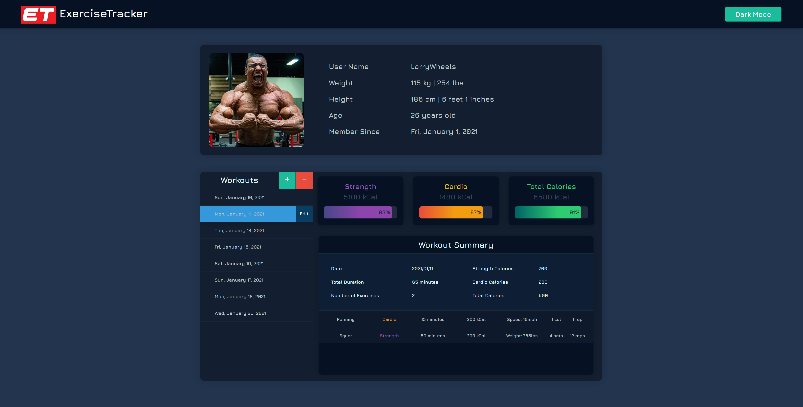

# ExerciseTracker

ExerciseTracker is a web app for keeping track of your workouts. It is implemented using React and Spring Boot. The app has a grid based dashboard for frontend and a unit-tested Restful API service for the backend.

