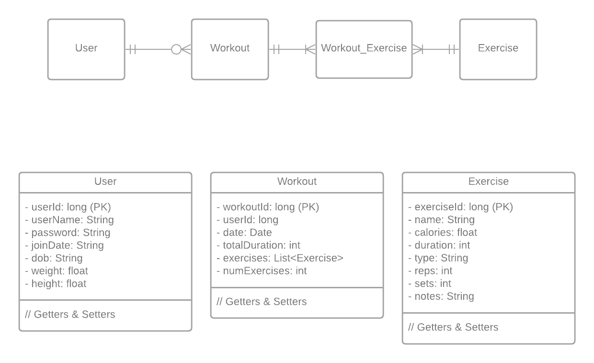

# ExerciseTracker REST API

---
## Overview
The Exercise Tracker API is a rudimentary API for keeping track of your workouts. 
The default measurements are in metric system and the dates are recorded in EST (GMT -5) timezone.
There are three main entities: User, Workout and Exercise. A User has none or many Workouts 
and each Workout has one or more Exercises. The high level details of the implementations are 
illustrated in the following diagram.



The API supports creating the User, Workout and Exercise entity as well as deleting them by their respective ids.
We can fetch all the workouts and exercises related to a given user and filter the exercise by type
(Cardio or Strength) as well. 

---
## User API
### Get all Users
**GET** ```localhost:9000/user```
### Add or Update User
**POST** ```localhost:9000/user```  
**PUT** ```localhost:9000/user```  
_Sample request body:_
```json
{
  "userName": "LarryWheels",
  "password": "strong123",
  "joinDate": "2021/01/01",
  "dob": "1994/12/3",
  "weight": 115, // in kg
  "height": 186 //in cm
}
```
### Delete User by userId
**DELETE** ```localhost:9000/user/{userId}```


## Workout API
### Get all Workouts
**GET** ```localhost:9000/workout```
### Add or Update Workout
**POST** ```localhost:9000/workout```  
**PUT** ```localhost:9000/workout```  
_Sample request body:_
```json
{
  "userId": 1,
  "date": "2021/01/15",
  "totalDuration": "60 minutes",
  "exercises": [
    {
      "calories": 140,
      "duration": 10, // minutes
      "name": "Running",
      "type": "Cardio",
      "reps": 1,
      "sets": 1,
      "notes": "Speed: 10mph"
    },
    {
      "calories": 400,
      "duration": 40, // minutes
      "name": "Deadlift",
      "type": "Strength",
      "reps": 12,
      "sets": 4,
      "notes": "Weight: 365lbs"
    }
  ],
  "numExercises": 2
}
```
### Delete Workout by workoutId
**DELETE** ```localhost:9000/workout/{workoutId}```
### Get Workouts by userId
**GET** ```localhost:9000/workout/user/{userId}```
### Get WorkoutIds by userId
**GET** ```localhost:9000/workout/user/{userId}/idonly```

##Exercise API
### Get all Exercises
**GET** ```localhost:9000/exercise```
### Add or Update Exercise
**POST** ```localhost:9000/exercise```  
**PUT** ```localhost:9000/exercise```  
_Sample request body:_
```json
{
  "calories": 360,
  "duration": 40,
  "name": "Bench Press",
  "type": "Strength",
  "reps": 12,
  "sets": 4,
  "notes": "Weight: 225lbs"
}
```
### Delete Exercise by exerciseId
**DELETE** ```localhost:9000/exercise/{exerciseId}```
### Get Exercises by workoutId
**GET** ```localhost:9000/exercise/workout/{workoutId}```
### Get Exercises by workoutId and exerciseType
**GET** ```localhost:9000/exercise/workout/{workoutId}/{exerciseType}```
### Get Exercises by userId
**GET** ```localhost:9000/exercise/workout/{workoutId}```
### Get Exercises by userId and exerciseType
**GET** ```localhost:9000/exercise/workout/{workoutId}/{exerciseType}```

---
## Unit testing
ExerciseTracker is unit tested with 100% method and line coverage for both the service and controller layer.

### Service Layer Unit Test Results


### Controller Layer Unit Test Results


---

